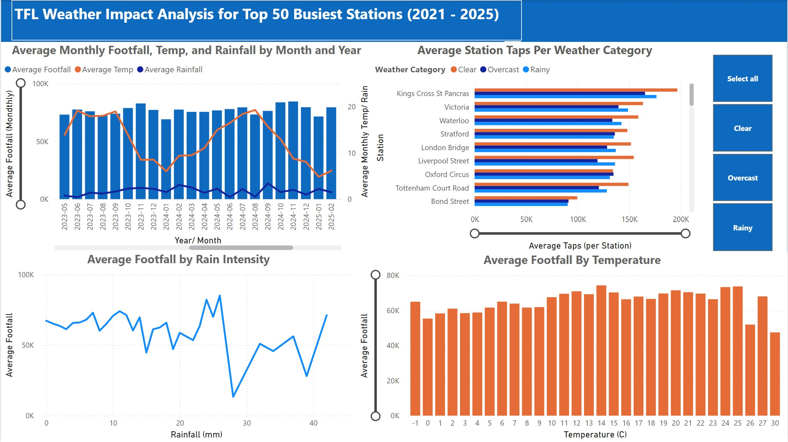

# TFL Weather Impact Analysis of Top 50 Busiest Stations

## Overview
This project provides an interactive look at the impact of weather conditions on footfall 
across London's 50 busiest TFL stations. 
The project provides insights into:
- Average footfall trends over time
- How footfall varies between stations under different weather conditions
- The 'tipping point' at which station footfall begins to drop off due to certain weather conditions
- Any stations in which passenger behaviour deviates from typical patterns

## Dashboard Preview

## Tech Stack
- VisualCrossing API
- Python & Pandas
- Matplotlib
- SQL (SQLite)
- Power BI

## Workflow
- Station footfall data was downloaded from https://tfl.gov.uk/corporate/publications-and-reports/network-demand-data and the Visual Crossing API https://www.visualcrossing.com/weather-api/ was programmatically called using the Python requests library.
- In order to avoid the API usage limit calls were limited to 10 daily and state was tracked and updated in a separate file.
- Once the data was collected, the footfall data files were concatenated and column names were formatted so that each dataset was in alignment.
- Checks were carried out for missing data and obvious outliers using basic visualisations
- Min and max functions were carried out on the Date values to ensure that dates were within the required range.
- A reusable function was then created which used SQLAlchemy to transfer the data to an SQLite database.
- SQL Views were created to optimise the data before carrying out visualisation using Power BI.

## How to Use
- Clone the repo
- Install the requirements 'pip install -r requirements.txt'
- Sign up to Visual Crossing the access your API key
- Run the fetch_weather_data.py file to retrieve the data
- Run the notebooks to transform the data and load to SQLite database
- Connect to PowerBI or visualisation tool of your choice

## Key Insights
- It was found that 3 stations: Leicester Square, Piccadilly Circus, and Canary Wharf stand out as they have more footfall during rainy and overcast weather than during clear day.
- Analysis revealed a 'shelter effect' where after the intial 'tipping point' of footfall dropping off at 2.5 mm of rain, footfall then rises again at 4 mm of rain possibly due to people taking shelter from heavy rain. 
- The average temperature 'tipping point' seems to be 26 degrees celsuis at which point overall station footfall shows noticible decline.